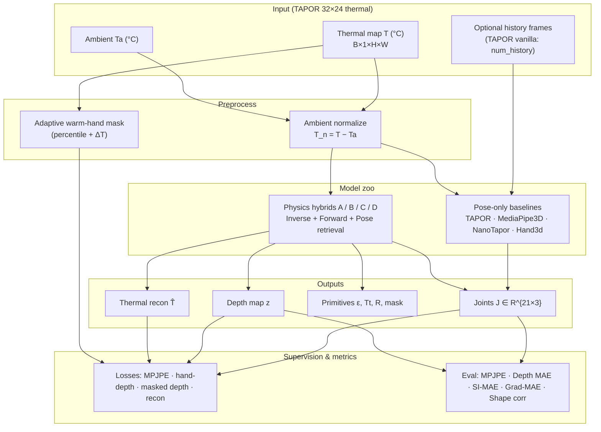

# Overall system

```mermaid
flowchart TB
  subgraph Input["Input (TAPOR 32×24 thermal)"]
    T["Thermal map T (°C)<br/>B×1×H×W"]
    Amb["Ambient Ta (°C)"]
    Hist["Optional history frames<br/>(TAPOR vanilla: num_history)"]
  end

  subgraph Norm["Preprocess"]
    AN["Ambient normalize<br/>T_n = T − Ta"]
    Mask["Adaptive warm-hand mask<br/>(percentile + ΔT)"]
  end

  subgraph Zoo["Model zoo"]
    direction TB
    PoseOnly["Pose-only baselines<br/>TAPOR · MediaPipe3D · NanoTapor · Hand3d"]
    Hybrids["Physics hybrids A / B / C / D<br/>Inverse + Forward + Pose retrieval"]
  end

  subgraph Out["Outputs"]
    J["Joints J ∈ R^{21×3}"]
    D["Depth map z"]
    Prim["Primitives ε, Tt, R, mask"]
    Rec["Thermal recon T̂"]
  end

  subgraph Super["Supervision & metrics"]
    L["Losses: MPJPE · hand-depth · masked depth · recon"]
    M["Eval: MPJPE · Depth MAE · SI-MAE · Grad-MAE · Shape corr"]
  end

  T --> AN
  Amb --> AN
  Hist --> PoseOnly
  AN --> PoseOnly
  AN --> Hybrids
  T --> Mask
  PoseOnly --> J
  Hybrids --> J
  Hybrids --> D
  Hybrids --> Prim
  Hybrids --> Rec
  J --> L
  D --> L
  Rec --> L
  Mask --> L
  J --> M
  D --> M
```
