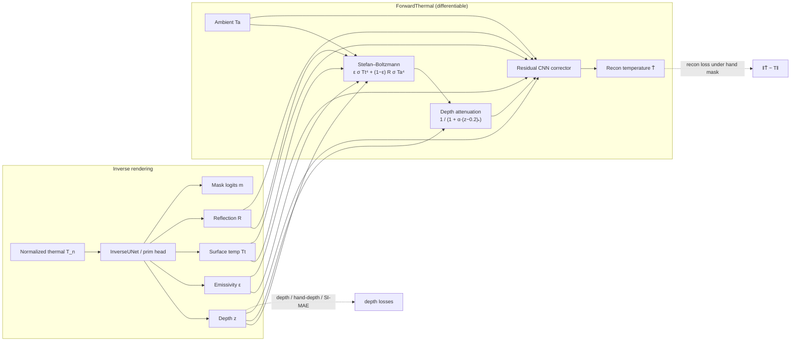
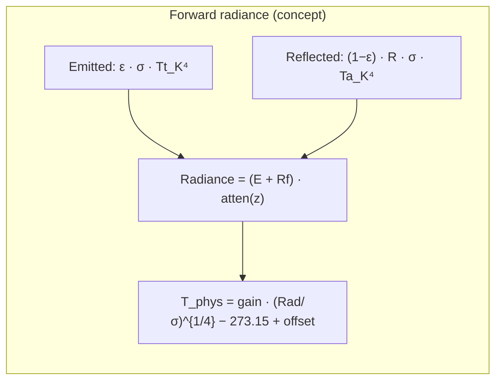

# Physics core (inverse + forward)

Shared by hybrids **A / C / D** (dedicated `InverseUNet`) and **B** (primitive head on ThermoSpace).

```mermaid
flowchart LR
  subgraph Inv["Inverse rendering"]
    Tn["Normalized thermal T_n"]
    UNet["InverseUNet / prim head"]
    Z["Depth z"]
    Eps["Emissivity ε"]
    Tt["Surface temp Tt"]
    R["Reflection R"]
    Mk["Mask logits m"]
    Tn --> UNet
    UNet --> Z
    UNet --> Eps
    UNet --> Tt
    UNet --> R
    UNet --> Mk
  end

  subgraph Fwd["ForwardThermal (differentiable)"]
    SB["Stefan–Boltzmann<br/>ε σ Tt⁴ + (1−ε) R σ Ta⁴"]
    Att["Depth attenuation<br/>1 / (1 + α·(z−0.2)₊)"]
    Res["Residual CNN corrector"]
    That["Recon temperature T̂"]
    Z --> SB
    Eps --> SB
    Tt --> SB
    R --> SB
    Amb2["Ambient Ta"] --> SB
    SB --> Att
    Z --> Att
    Att --> Res
    Z --> Res
    Eps --> Res
    Tt --> Res
    R --> Res
    Amb2 --> Res
    Res --> That
  end

  That -.->|"recon loss under hand mask"| LossRec["‖T̂ − T‖"]
  Z -.->|"depth / hand-depth / SI-MAE"| LossD["depth losses"]
```

```mermaid
flowchart TB
  subgraph PhysEq["Forward radiance (concept)"]
    direction TB
    E["Emitted: ε · σ · Tt_K⁴"]
    Rf["Reflected: (1−ε) · R · σ · Ta_K⁴"]
    Rad["Radiance = (E + Rf) · atten(z)"]
    Tphys["T_phys = gain · (Rad/σ)^{1/4} − 273.15 + offset"]
    E --> Rad
    Rf --> Rad
    Rad --> Tphys
  end
```
