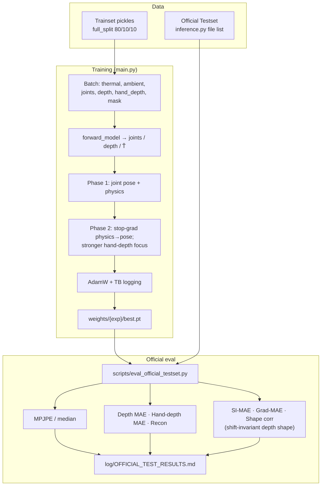
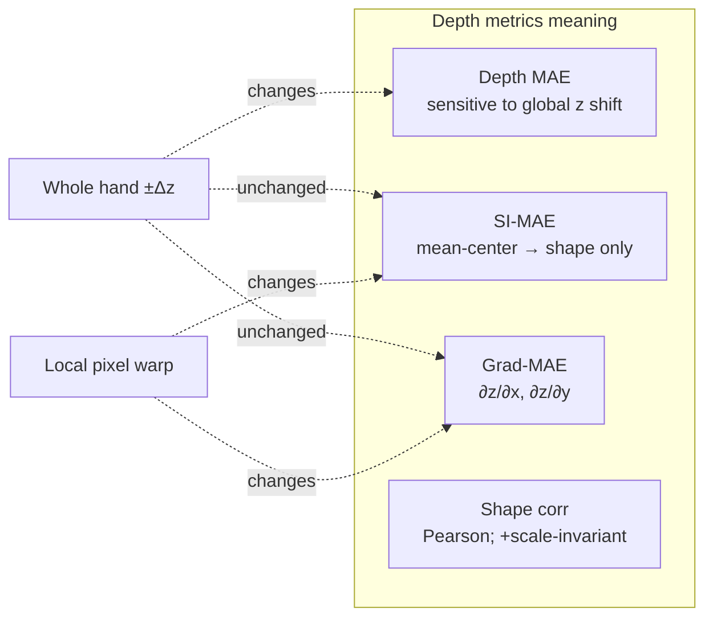

# Training & evaluation flow

```mermaid
flowchart TB
  subgraph Data["Data"]
    Train["Trainset pickles<br/>full_split 80/10/10"]
    OffTest["Official Testset<br/>inference.py file list"]
  end

  subgraph TrainLoop["Training (main.py)"]
    Batch["Batch: thermal, ambient,<br/>joints, depth, hand_depth, mask"]
    Fwd["forward_model → joints / depth / T̂"]
    Phase1["Phase 1: joint pose + physics"]
    Phase2["Phase 2: stop-grad physics→pose;<br/>stronger hand-depth focus"]
    Opt["AdamW + TB logging"]
    Best["weights/{exp}/best.pt"]
  end

  subgraph Eval["Official eval"]
    Scr["scripts/eval_official_testset.py"]
    PoseM["MPJPE / median"]
    AbsD["Depth MAE · Hand-depth MAE · Recon"]
    Shape["SI-MAE · Grad-MAE · Shape corr<br/>(shift-invariant depth shape)"]
    MD["log/OFFICIAL_TEST_RESULTS.md"]
  end

  Train --> Batch
  Batch --> Fwd
  Fwd --> Phase1
  Phase1 --> Phase2
  Phase2 --> Opt
  Opt --> Best
  Best --> Scr
  OffTest --> Scr
  Scr --> PoseM
  Scr --> AbsD
  Scr --> Shape
  PoseM --> MD
  AbsD --> MD
  Shape --> MD
```

```mermaid
flowchart LR
  subgraph Metrics["Depth metrics meaning"]
    Abs["Depth MAE<br/>sensitive to global z shift"]
    SI["SI-MAE<br/>mean-center → shape only"]
    Grad["Grad-MAE<br/>∂z/∂x, ∂z/∂y"]
    Corr["Shape corr<br/>Pearson; +scale-invariant"]
  end
  Shift["Whole hand ±Δz"] -.->|"changes"| Abs
  Shift -.->|"unchanged"| SI
  Shift -.->|"unchanged"| Grad
  Warp["Local pixel warp"] -.->|"changes"| SI
  Warp -.->|"changes"| Grad
```
