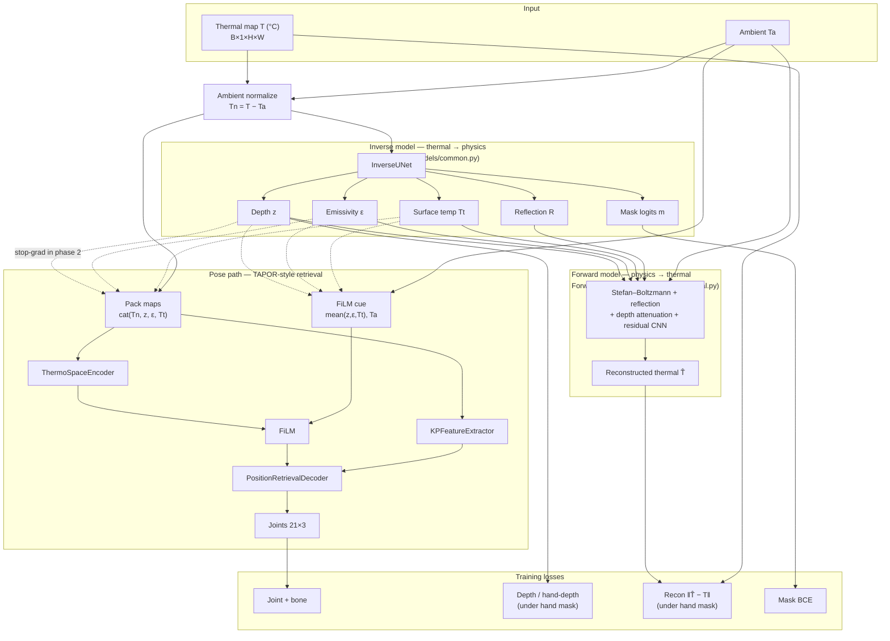
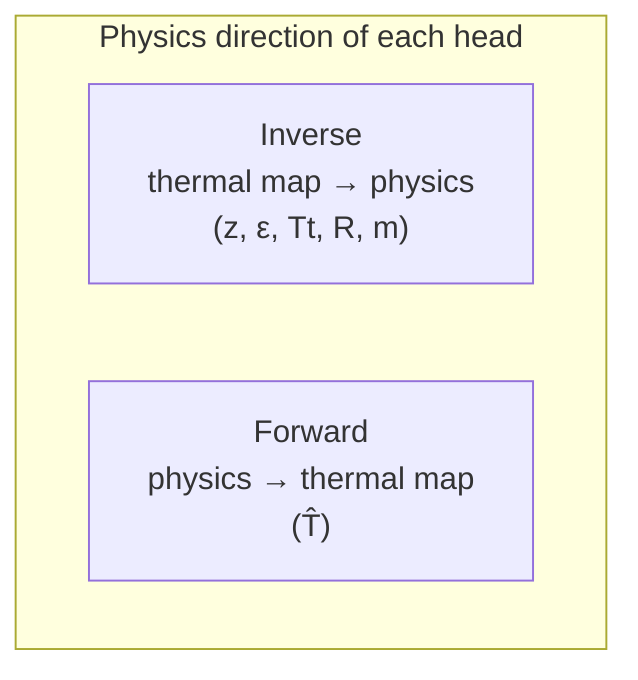

# Hybrid A — system diagram

**Inverse** = thermal map → physics primitives  
**Forward** = physics primitives → reconstructed thermal map  

```mermaid
flowchart TB
  subgraph Input["Input"]
    T["Thermal map T (°C)<br/>B×1×H×W"]
    Ta["Ambient Ta"]
  end

  AN["Ambient normalize<br/>Tn = T − Ta"]

  subgraph Inverse["Inverse model — thermal → physics<br/>InverseUNet (models/common.py)"]
    Inv["InverseUNet"]
    Z["Depth z"]
    Eps["Emissivity ε"]
    Tt["Surface temp Tt"]
    R["Reflection R"]
    M["Mask logits m"]
    Inv --> Z
    Inv --> Eps
    Inv --> Tt
    Inv --> R
    Inv --> M
  end

  subgraph Forward["Forward model — physics → thermal<br/>ForwardThermal (models/forward_thermal.py)"]
    Fwd["Stefan–Boltzmann + reflection<br/>+ depth attenuation + residual CNN"]
    That["Reconstructed thermal T̂"]
    Fwd --> That
  end

  subgraph Pose["Pose path — TAPOR-style retrieval"]
    Pack["Pack maps<br/>cat(Tn, z, ε, Tt)"]
    Thermo["ThermoSpaceEncoder"]
    Cue["FiLM cue<br/>mean(z,ε,Tt), Ta"]
    FiLM["FiLM"]
    KP["KPFeatureExtractor"]
    Dec["PositionRetrievalDecoder"]
    J["Joints 21×3"]
  end

  subgraph Losses["Training losses"]
    LJ["Joint + bone"]
    LD["Depth / hand-depth<br/>(under hand mask)"]
    LR["Recon ‖T̂ − T‖<br/>(under hand mask)"]
    LM["Mask BCE"]
  end

  T --> AN
  Ta --> AN
  AN --> Inv

  Z --> Fwd
  Eps --> Fwd
  Tt --> Fwd
  R --> Fwd
  Ta --> Fwd

  Z -.->|"stop-grad in phase 2"| Pack
  Eps -.-> Pack
  Tt -.-> Pack
  AN --> Pack
  Pack --> Thermo
  Pack --> KP
  Z -.-> Cue
  Eps -.-> Cue
  Tt -.-> Cue
  Ta --> Cue
  Thermo --> FiLM
  Cue --> FiLM
  FiLM --> Dec
  KP --> Dec
  Dec --> J

  J --> LJ
  Z --> LD
  That --> LR
  M --> LM
  T --> LR
```

```mermaid
flowchart LR
  subgraph Direction["Physics direction of each head"]
    direction LR
    I["Inverse<br/>thermal map → physics<br/>(z, ε, Tt, R, m)"]
    F["Forward<br/>physics → thermal map<br/>(T̂)"]
  end
```
